Salut tous!!!
Today, on s'accroche sur la room **BluePrint** de TryHackMe.

Cette salle est constitué de deux questions.

Sans plus tarder, lançons-nous dans cette aventure. Nous commençons par une reconnaissance de la machine avec l'outil **nmap**

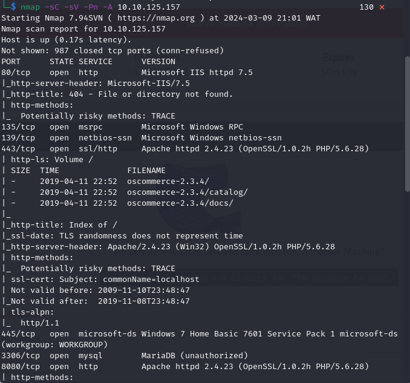
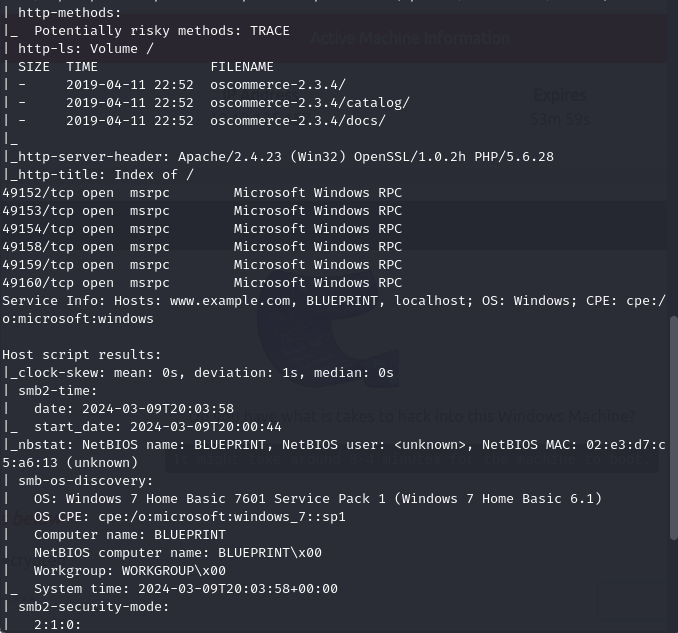
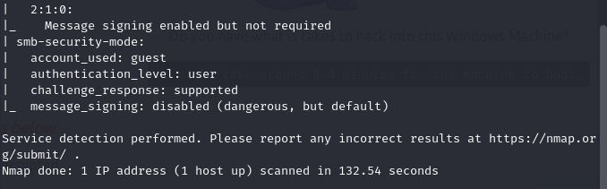

Grâce à cette reconnaissance on sait qu'il s'agit d'une machine qui tourne avec pour système d'exploitation Windows 7 et de plus on a plusieurs services en cours d'exécution. Explorons rapidement les services web sur les ports 80 et 8080

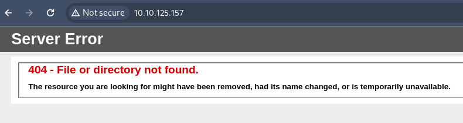

Sur le port 80, nous voilà face à une erreur 404 sautons sur celui du port 8080.

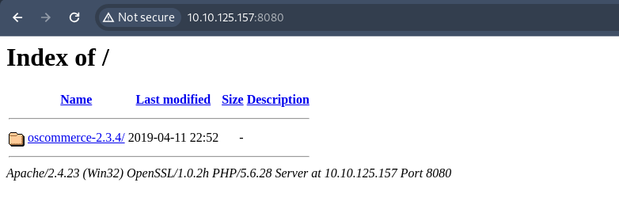

Okay, on a un indexage de fichier et en continuant plus loin on tombe sur un site web e-commerce.

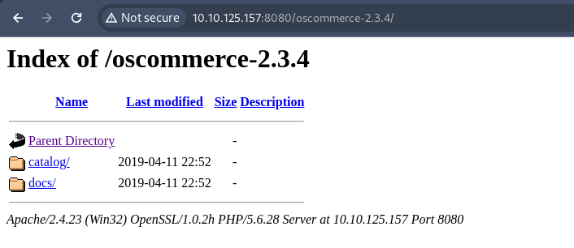
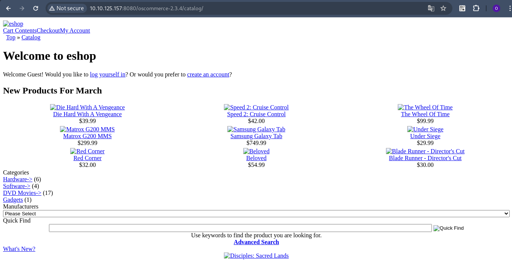

Dans le répertoire **docs** vous trouverez plein d'autres fichiers mais je pense que du côté de catalog on trouvera des trucs bien plus interessant.

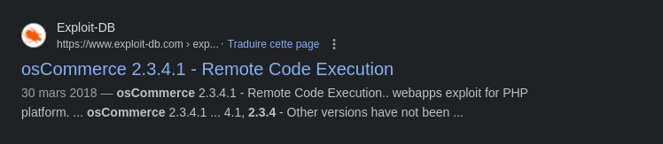

Ne sachant pas ce que c'est **oscommerce** j'ai effectué une peite recherche et le premier article parle déjà d'exploit... Très interessant hihihi.

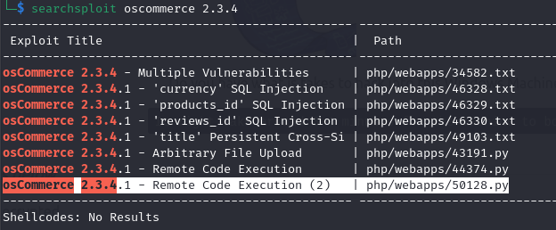
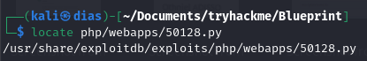

Avec la commande **searchsploit** et **locate** bon j'ai le fichier d'exploit plus qu'à tester.\n
NB: Si vous ne trouvez pas d'exploit avec l'outil searchsploit faites un tour sur internet et fouillez correctement vous allez tomber sur des trucs interessants.

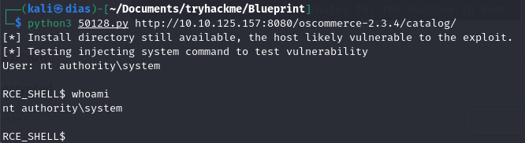
