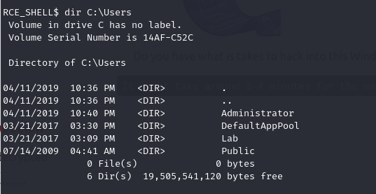
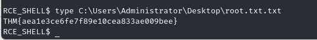
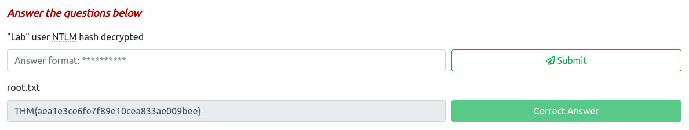
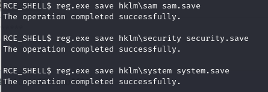
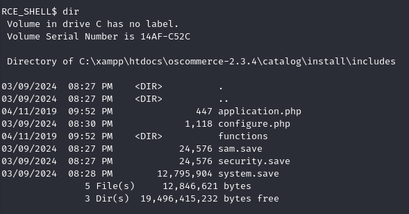
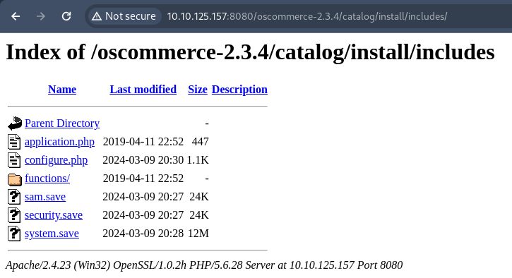
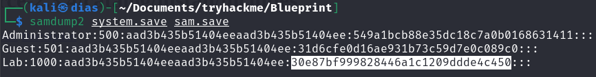
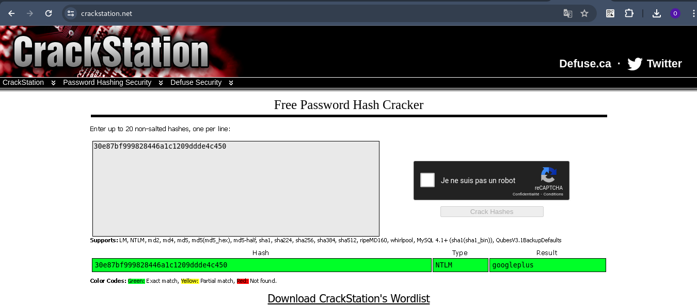
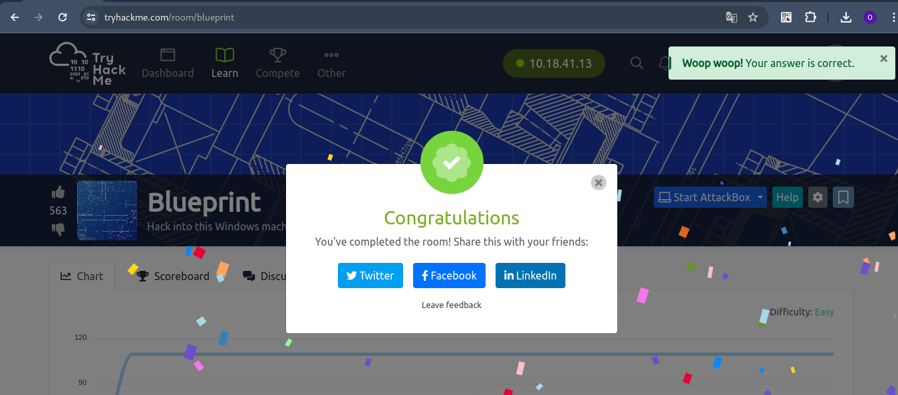
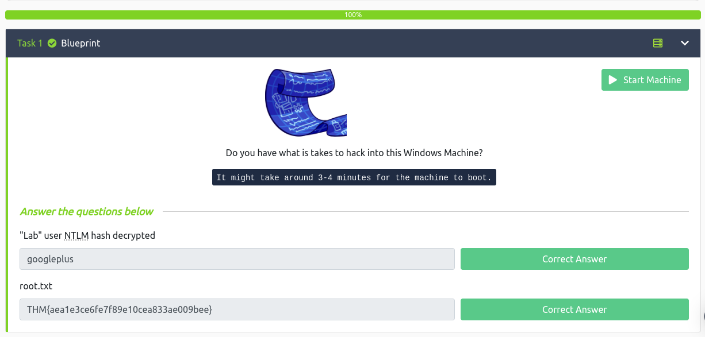

Salut tous!!!
Today, on s'accroche sur la room **BluePrint** de TryHackMe.

Cette salle est constituée de deux questions.

Sans plus tarder, lançons-nous dans cette aventure. Nous commençons par une reconnaissance de la machine avec l'outil **nmap**

Grâce à cette reconnaissance, on sait qu'il s'agit d'une machine qui fonctionne sous le système d'exploitation Windows 7, et de plus, plusieurs services sont en cours d'exécution. Explorons rapidement les services web sur les ports 80 et 8080.

Sur le port 80, nous nous retrouvons face à une erreur 404. Passons maintenant au port 8080.

D'accord, nous avons un indexage de fichiers, et en continuant plus loin, nous tombons sur un site web e-commerce.

Dans le répertoire **docs**, vous trouverez de nombreux autres fichiers, mais je pense que du côté du répertoire **catalog**, nous trouverons des éléments bien plus intéressants.

Ne sachant pas ce qu'est **oscommerce**, j'ai effectué une petite recherche et le premier article parle déjà d'exploit... Très intéressant hihihi

Avec la commande **searchsploit** et **locate**, j'ai le fichier d'exploit il ne me reste qu'à tester.

NB: Si vous ne trouvez pas d'exploit avec l'outil Searchsploit, faites un tour sur Internet et fouillez correctement. Vous allez tomber sur des choses intéressantes.

Bon voilà, on a eu shell cool...

Bon vite vite, voyons voir les différents comptes sur cette machine.

Ok, je me suis accroché rapidement au compte **Administator** et avec un peu de fouille dans tous les répertoires je suis tombé sur le fichier *root.txt.txt*.. good good.

Ok, Let's go... allons à la recherche du hachage NTLM de l'utilisateur "Lab" déchiffré.

A cette étape étant un peu perdu, cet article m'a aidé : https://aas-s3curity.gitbook.io/cheatsheet/internalpentest/active-directory/post-exploitation/extracting-credentials/retrieve-windows-hashes pour l'extraction des credentials des users.

J'ai compris que les hachages NTLM sont stockés dans la base de données SAM sur la machine ou dans la base de données NTDS du contrôleur de domaine. Il existe plusieurs méthodes pour extraire les credentials en voici une:

L'exécutable reg.exe m'a permis de sauvegarder une partie ou l'intégralité de la base de registre. Ensuite, j'ai téléchargé ces fichiers sur ma propre machine et avec l'outil **samdump2**, j'ai extrait les hachages LM et NTLM des informations d'identification des comptes. Il m'a suffi de les décrypter ici: https://crackstation.net/

Vous pouvez utiliser ce script: https://github.com/fortra/impacket/blob/master/examples/secretsdump.py au lieu de l'outil **samdump2** si l'installation n'a pas réussi.

Bon voilà tout est bien qui finit bien à une prochaine fois...😆😆
