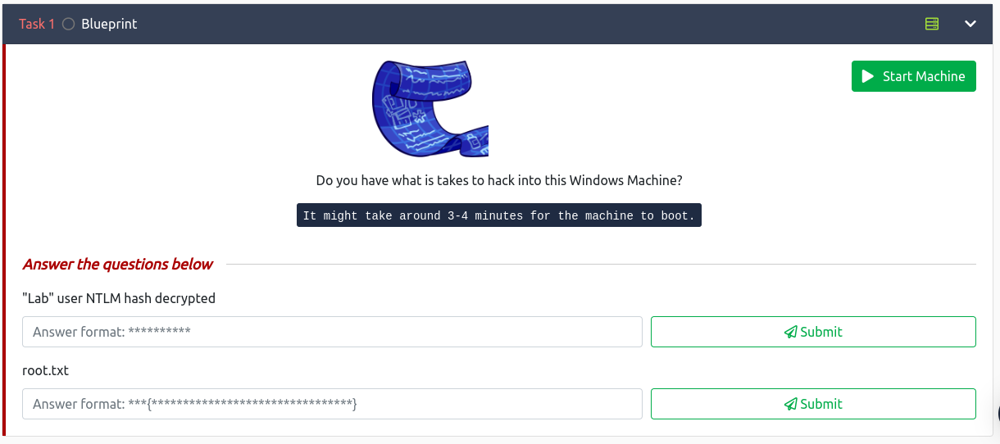

Salut tous!!!
Today, on s'accroche sur la room **BluePrint** de TryHackMe.

Cette salle est constitué de deux questions.

Sans plus tarder, lançons-nous dans cette aventure. Nous commençons par une reconnaissance de la machine avec l'outil **nmap**

Grâce à cette reconnaissance on sait qu'il s'agit d'une machine qui tourne avec pour système d'exploitation Windows 7 et de plus on a plusieurs services en cours d'exécution. Explorons rapidement les services web sur les ports 80 et 8080

Sur le port 80, nous voilà face à une erreur 404 sautons sur celui du port 8080.

