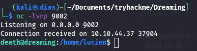

Hi, hope you are well. As you can see, this is the first time I've shared my gym experience on TryHackMe. I hope you like it. The presentation focuses on the new “Dreaming” room of TryHackMe, a very exciting “Easy” level.

I started by checking for open ports on the IP address I received with the nmap tool using the command **nmap -sV -vv IP** 
The result shows that I have ports 22 and 80 open with the respective ssh and http services. Ok, so it's off to a good start.

Here is what the website shows us deploy on port 80.

So I run a scan of the site's subfolders with gobuster.

Okay, I think searching subfolders led us to an important discovery. The **/app** subfolder which in turn leads us to another website set up with the **pluck CMS**.

**A file upload restriction bypass** vulnerability in **Pluck CMS version 4.7.13**, and with the **searchsploit** command I was able to find some python code that I copied to my working directory to exploit the vulnerability.

This python code takes as parameters the **IP, the port, the connection password and the path to access the connection page**. I searched for default password on pluck CMS and came across **password**. This python code gives us direct **p0wny shell** access to the server and we access it with the link it generates.

To further investigate, I configured my machine to listen on port 9001. Next, I executed a reverse shell command via the P0wny shell.

After gaining access as user **"www-data"**, I initiated the privilege escalation process. My first success was to locate the flag associated with the user **"Lucien"**. After exploring various files, I finally accessed the **/opt** directory where two files contained the information necessary to recover Lucien's password. Using this data, I managed to connect as Lucien via the SSH service using the password I had discovered... Ouff.

Following the acquisition of Lucien's flag, I noticed that the **getDreams.py** file was present in the directory of the **"death"** user as well as in the **/opt** directory. Although I was able to open it in the latter location, I could not find a password there.

