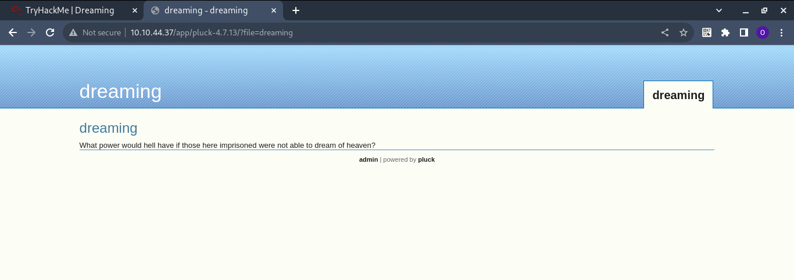

Hi, hope you are well. As you can see, this is the first time I've shared my gym experience on TryHackMe. I hope you like it. The presentation focuses on the new “Dreaming” room of TryHackMe, a very exciting “Easy” level.

I started by checking for open ports on the IP address I received with the nmap tool using the command **nmap -sV -vv IP** 
The result shows that I have ports 22 and 80 open with the respective ssh and http services. Ok, so it's off to a good start.

Here is what the website shows us deploy on port 80.

So I run a scan of the site's subfolders with gobuster.

Okay, I think searching subfolders led us to an important discovery. The **/app** subfolder which in turn leads us to another website set up with the **pluck CMS**.

**A file upload restriction bypass** vulnerability in **Pluck CMS version 4.7.13**, and with the **searchsploit** command I was able to find some python code that I copied to my working directory to exploit the vulnerability.

