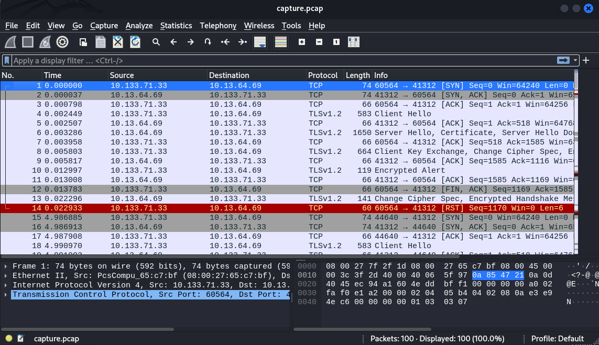
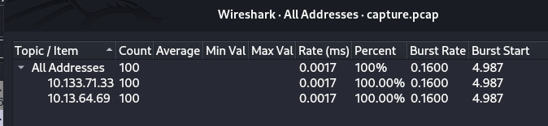
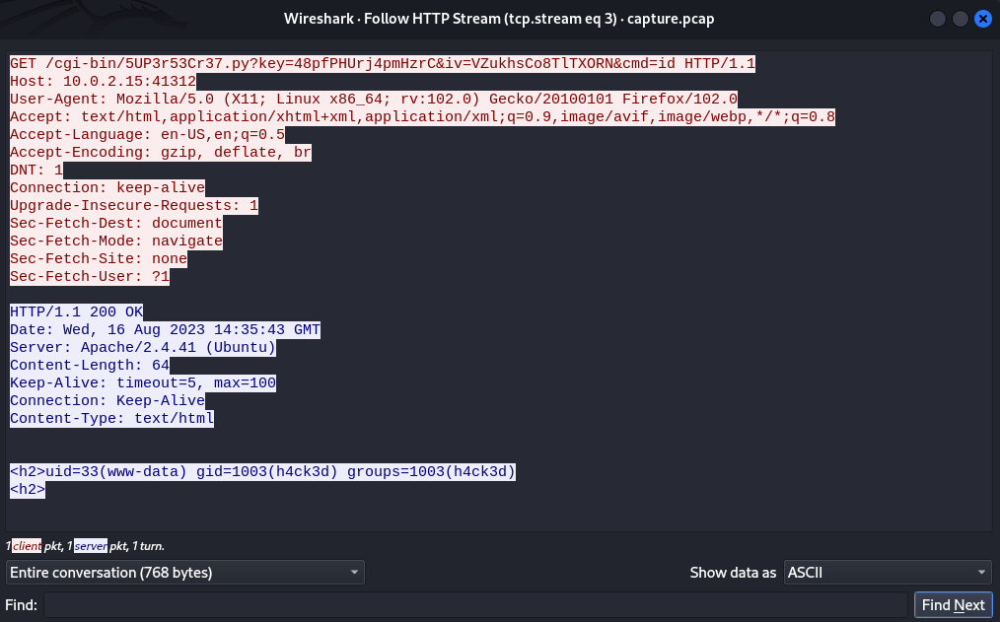
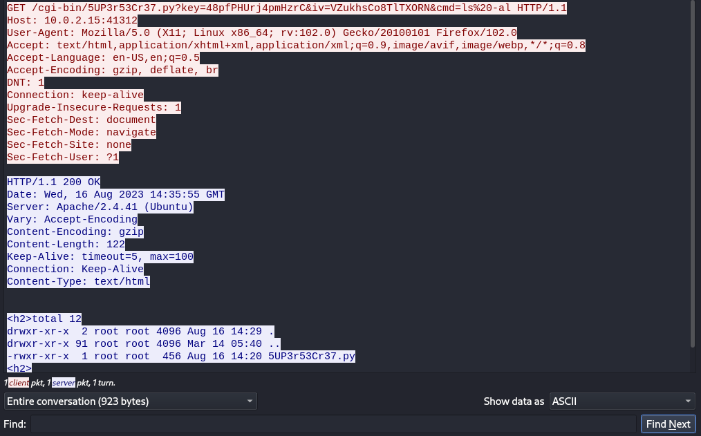

Hello It's Me Again. We are going to work on a new room on THM. Let's go.
The name of the room is: **WhyHackMe**.

As usual I always start with a list of ports to know the open ports and the services available.

There are 3 ports open on 21, 22 and 80 with the respective services: ftp, ssh and http.
nmap shows us an 'update.txt' file and that we can log in as Anonymous. Let's download the file to our machine to learn more.

Ok the update.txt container is a note from the admin specifying that the new information for the new account is only accessible via localhost in the pass.txt file.

This is the website that is hosted and is a blog on which we must login.
not having the connection information, I made a small enumeration of the subdirectories with the dirsearch tool. and here are the available directories:
/assets/
/config.php
/login.php
/register.php

These directories don't give anything important so I register then I connect to the vulnerability search.

After logging in, I saw the comment area so I tested a little alert with Javascript. Well no return, after a good hour without success, I decided to look at the register and login directories and bimm my alert ended up not working.

It happened that the username space was vulnerable to the **xss attack** and when you put a bim comment the script takes effect.

Well that's one step, now how to have a connection to the server. I remembered the message from the admin concerning the pass.txt file which was only accessible on **127.0.0.1/dir/pass.txt**. So I had to find a way to open the file from the website. So with a little digging on the internet I came across something interesting on the hacktricks website.

This piece of JavaScript code appears to be an attempt to execute an "XMLHttpRequest" attack using AJAX requests to retrieve the contents of a remote file and transmit it to an attacker on a remote server.
Here I just change the server addresses and I test it.

Here I just change the server addresses and I test it.
I just put the code in the payload.js file then I started the python server to download the payload file to the target. Then I create a new user with the correct payload, then I create a comment to download it and I wait a little and I get back the contents of the pass.txt file. With cyberchef I decrypt and connect via ssh.

Here we are on the server and boom the user flag.
Let's skip the privilege escalation. Let's display the privileges of user jack regarding the use of the sudo command. Well only iptables is targeted.

I downloaded linpeas.sh for more advanced enumeration but nothing good, just a password. Well we'll see.

Well I fell into the /opt directory, I found a .pcap file and another text file. The text file makes it clear that the admin cannot delete the files located in the /usr/lib/cgi-bin/ directory even if he is user root, that he has temporarily blocked access to the backdoor using iptable rules.

After downloading the pcap file with scp I take a look at it. It contains 100 packets and it is encrypted using the TLSv1.2 protocol.
Only two IP addresses are communicating in this capture: 10.133.71.33 et 10.13.64.69

Thanks to find I found the decryption key in /etc/apache2/certs/apache.key which I also downloaded. Then in wireshark, Edit-->Preferences-->Protocols-->TLS I import the key with IP 10.133.71.33 and port 41312, and I update wireshark. There I see http traffic.

During these http communications we see that commands are sent to the server via port 41312 and the server returns the output of the commands.
I quickly tested this url in my browser "http://<IP>:41312/cgi-bin/5UP3r53Cr37.py?key=48pfPHUrj4pmHzrC&iv=VZukhsCo8TlTXORN&cmd=id" no output, but let's remember that iptables rules were applied and since jack can use this command with sudo, let's create a new rule.
